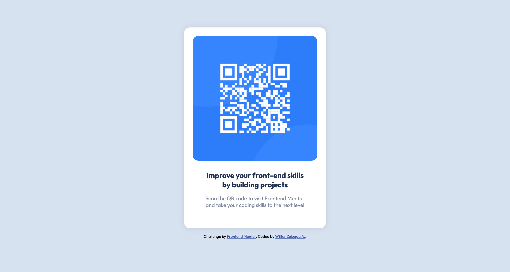

# Frontend Mentor - QR code component solution

This is a solution to the [QR code component challenge on Frontend Mentor](https://www.frontendmentor.io/challenges/qr-code-component-iux_sIO_H). Frontend Mentor challenges help you improve your coding skills by building realistic projects. 

## Table of contents

- [Overview](#overview)
  - [Screenshot](#screenshot)
  - [Links](#links)
- [My process](#my-process)
  - [Built with](#built-with)
  - [What I learned](#what-i-learned)
  - [Continued development](#continued-development)
  - [Useful resources](#useful-resources)
- [Author](#author)
- [Acknowledgments](#acknowledgments)


## Overview

This is a small project about a card in which we can show a QR code, along with a catchy title and some information about what it would show us when we scan it.

### Screenshot

This is the screenshot of the card in a Desktop device:



This is the screenshot of the card in a Mobile device:


## My process

I started doing a little analysis to define how to structure the HTML code, adapting it to the use of "divs", which would be styled later on.

Once structured, I proceeded to write a basic CSS, to remove some styles that the browser incorporates by default, such as padding and margin on the page.

I used the Flexbox tool to position each element in the desired place, as well as making sure that all styles handled were responsive.

I stored the suggested colors in CSS variables, which would make my job easier if I needed to use the same color more than once, and thus avoid using the color codes repetitively.

Once the desktop site was finished, I proceeded to add some Media Query to style the mobile site, assigning a maximum width of 375 pixels for mobile devices, in which texts are rescaled, in addition to some padding.

### Built with

- Semantic HTML5 markup
- CSS custom properties
- Flexbox

### What I learned

I learned to use CSS variables, which are very useful when you need to use the same color more than once, and thus avoid using the color codes repeatedly, which must be stored in the root of the CSS code.

```html
<h1>Some HTML code I'm proud of</h1>
```
```css
:root {
  --White: hsl(0, 0%, 100%);
}

body {
  background-color: var(--White);
}
```

### Continued development

I would like to continue learning about CSS, and in the future I would like to learn about JavaScript, to be able to create more dynamic websites.

### Useful resources

- [CSS Variables](https://developer.mozilla.org/en-US/docs/Web/CSS/Using_CSS_custom_properties) - This helped me to understand how to use CSS variables, which are very useful when you need to use the same color more than once, and thus avoid using the color codes repeatedly, which must be stored in the root of the CSS code.


## Author

- Website - [Wilfer Zuluaga A.](https://github.com/Wilpoymu)
- Frontend Mentor - [@Wilpoymu](https://www.frontendmentor.io/profile/Wilpoymu)
- LinkedIn - [Wilfer Zuluaga A.](https://www.linkedin.com/in/wilfer-zuluaga-aristizabal)


## Acknowledgments

I would like to thank Frontend Mentor for the opportunity to improve my skills, and also to the people who have helped me in the process of learning.
